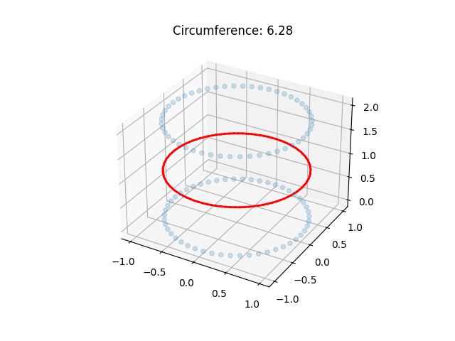

XIPL Assignment Demo – 3D Body Measurement & Garment Recommendation System

Project Overview

This project implements an end-to-end system for three main tasks:
Q1: Extracting body measurements from a 3D mesh
Q2: Cleaning, normalizing, and validating user-provided measurements
Q3: Recommending the top 3 best-fitting garments using a multi-constraint scoring algorithm

The system combines 3D geometry, data validation, and recommendation algorithms into an interactive Streamlit application.

Key Highlights
	•	Robust mesh slicing algorithm to compute circumference at any height
	•	Intelligent unit normalization and outlier detection
	•	Real-world inspired asymmetric fit scoring
	•	Scalable design with future optimization strategies

Project Structure

q1_mesh.py
This file computes circumference at a given height (height_z). It detects triangle-plane intersections, interpolates intersection points, sorts them into a closed loop (polyline), and calculates the total perimeter.

q1_visualize.py
This file visualizes the 3D mesh using Matplotlib. It highlights the computed cross-section in red and uses a cylindrical mesh to simulate a human torso for demonstration.

q2_sanitize.py
This file implements the DataSanitizer class. It automatically detects units and converts inches to centimeters. It validates data using proportional rules such as waist should not exceed height and chest should be at least 30% of height. It also estimates missing values, for example arm length is calculated as 0.45 times height.

q3_search.py
This file implements the Best-Fit Multi-Constraint Algorithm. It uses asymmetric penalty logic where garments that are too small get a high penalty and garments that are too large get a low penalty. Chest measurement is given higher importance with double weight. The output returns the top 3 garments along with a fit confidence score between 0 and 100.

app.py
This is the Streamlit-based user interface. It allows users to input their measurements, view normalized and validated data, detect issues instantly, and get the top 3 garment recommendations along with fit quality.

How to Run

First install dependencies using:
pip install -r requirements.txt

Then run the application using:
streamlit run app.py

Optional step for Q1 visualization:
python q1_visualize.py

Assumptions
	•	The mesh is continuous and smooth
	•	Human body is approximated as a continuous surface
	•	Measurement inputs fall within realistic human ranges
	•	Garment database is structured and clean

Limitations
	•	Q1 assumes a single continuous loop and may not work for complex meshes
	•	Q2 unit detection is heuristic-based
	•	Q3 uses linear search which is not optimal for very large datasets

Complexity Analysis
	•	Q1 runs in O(F) where F is the number of mesh faces
	•	Q2 runs in O(n) where n is the number of measurements
	•	Q3 runs in O(N log N) due to sorting

Example Output

Normalized Data:
Height: 170 cm
Chest: 90 cm
Waist: 80 cm
Hip: 95 cm
Arm: 76.5 cm (estimated)

Issues Found:
No issues detected

Top 3 Garments:
Rank 1 → Garment ID: 1, Score: 100, Excellent Fit
Rank 2 → Garment ID: 2, Score: 93, Excellent Fit
Rank 3 → Garment ID: 15, Score: 60, Average Fit

Scalability Strategy

For large datasets around 1 million garments:
	•	Use KD-Tree or BallTree for faster nearest neighbor search
	•	Use vector databases such as Milvus or Pinecone
	•	Precompute embeddings for faster similarity matching

Future Improvements
	•	Use advanced libraries like Trimesh for better mesh processing
	•	Add interactive 3D visualization using Three.js or WebGL
	•	Extend measurements such as inseam and shoulder width
	•	Learn scoring weights from user feedback
	•	Introduce machine learning-based fit prediction

Conclusion

This project demonstrates a practical solution for apparel fitting by combining 3D geometric computation, data validation, and intelligent recommendation algorithms. The system is modular, scalable, and suitable for real-world applications.